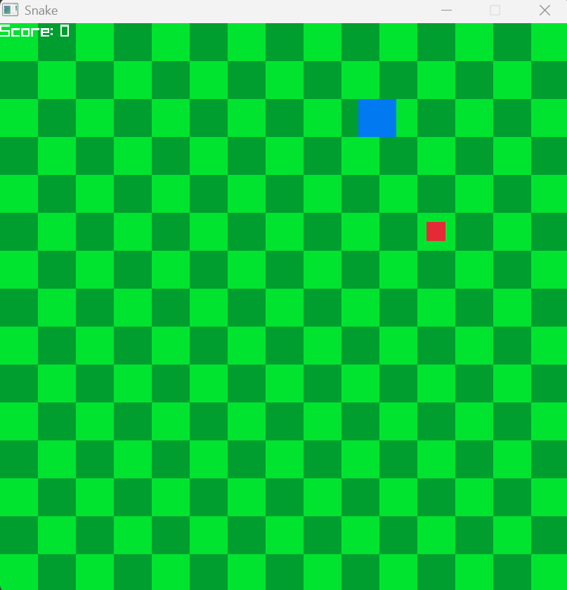

# Snake

a snake based game I made in c++ using Raylib. The project was supposed to get me more confortable with c++

## Demo



## Features

- snake that the user can control with wasd.

- apples to eat so the snake can get bigger and increase score.

- tiled backround just like the snake game.

## Installation

run build.ps1 to get an executable

## Usage

```powershell
"build.ps1"
.\snake.exe
```
open up the application and run the program. Press enter to start the game and to replay when on the game over screen.